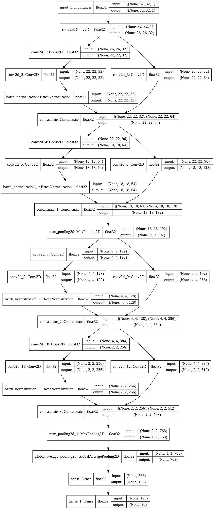

# Tensorflow OCR
Perform OCR on alphabets and digits using tensorflow 

## Requirements
 * Tensorflow 2.2.0
 * Numpy      3.7.6
 * Opencv     
 * gdown
 * sklearn
 * Tensorboard
 
## DataSet
I have used combination two datasets 
 * Mnist Digits (contains 0-9 digits)
 * NIST special Database 19  (contains a-z alphabets)

## Model 
We have Used ResNet styled architechture for better perfomance 

Model Architecture.

    

